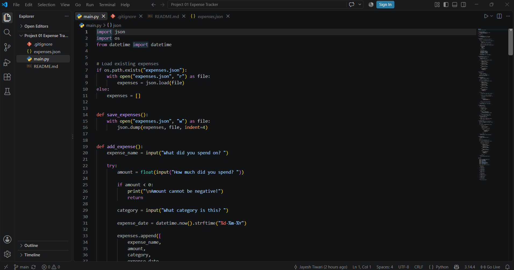
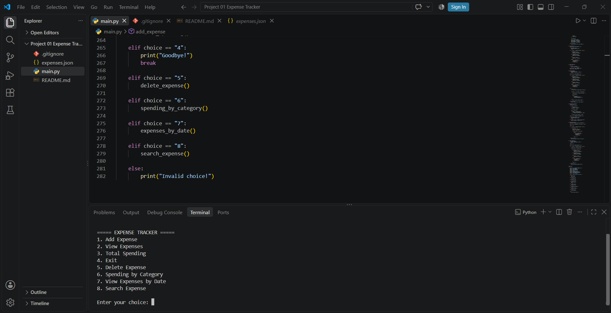
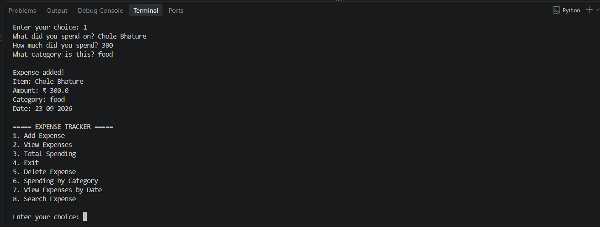
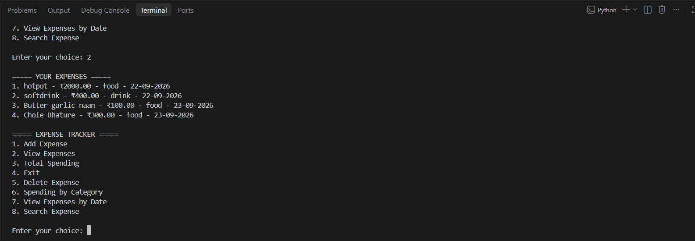
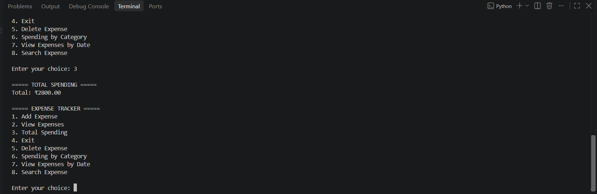
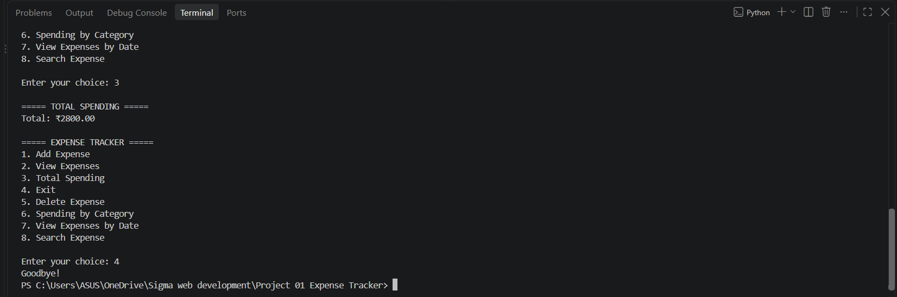

# Expense Tracker

A command-line Expense Tracker built with Python for managing daily expenses.

## Features

- Add new expenses
- View all expenses
- Delete expenses
- Calculate total spending
- Track spending by category
- View expenses by date
- Search expenses by name
- Automatic date tracking
- Input validation
- Persistent data storage using JSON

## Technologies Used

- Python 3
- JSON
- File Handling
- Datetime
- Git & GitHub

## How to Run

1. Clone the repository:

```bash
git clone https://github.com/jtiwari634-stack/expense-tracker.git

## Demo

### Expense Tracker in Action











